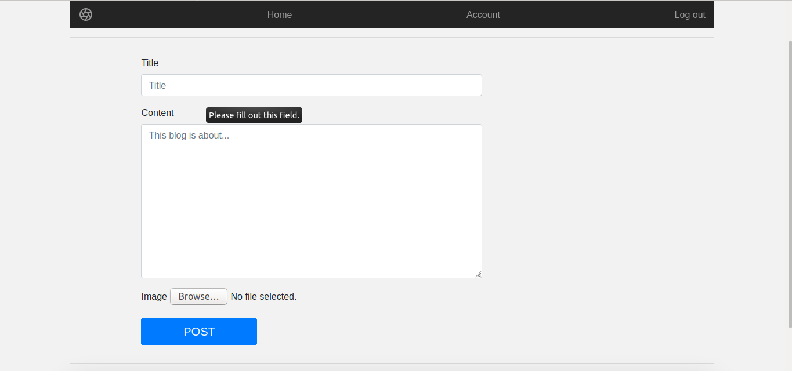

# anylearntech
## DEPLOYED TEMPORARILY ON: http://proffesergio.pythonanywhere.com

## CURRENTLY RUNNING ON HEROKU SERVER: https://anylearnblog.herokuapp.com

A simple blogging web app where a user can-

 -> Create an account
 
 -> Login to the account
 
 -> Create a new post
 
 -> Update own post
 
 -> Change the username (must be unique)
 
 -> Change the password (must be 8 characters long at least)
 
 -> View all available posts on the site created by other users

## LANDING PAGE

## CREATE A NEW POST

